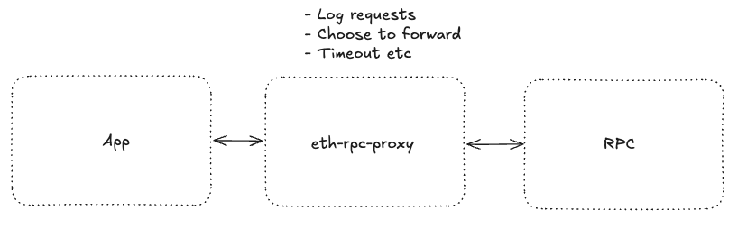

# 📦 eth-rpc-proxy
[](https://github.com/aodhgan/eth-rpc-proxy/actions/workflows/CI.yml)

A lightweight RPC proxy server for **JSON-RPC (HTTP + WebSocket)** built on [Hono](https://hono.dev).  
Useful for testing, debugging, and simulating RPC calls over different network behaviors (forward, drop, fail).



---

## ✨ Features
- 🚀 Forward JSON-RPC requests (HTTP + WS) to an upstream node (e.g. Anvil, Geth, Hardhat)  
- 🎲 Deterministic or probabilistic (chaos) proxy behavior (forward / not answer / fail)  
- 🔌 WebSocket + HTTP support  
- 🧪 Designed for testing blockchain RPC clients  

---

## 📦 Installation

```bash
pnpm add eth-rpc-proxy
# or
npm install eth-rpc-proxy
```

## Usage
### Basic Example
See what your client is doing under the hood! A single Viem `sendTransaction` may be doing more than you think. 
Get programmatic logs like:

```ts
        ...
        proxy = new ProxyServer(new URL("http://localhost:8545"), 3000, logger); // forward requests to Anvil (already running)
		proxy.setDefaultMode(ProxyMode.Deterministic); // mode to forward all requests
		await proxy.start();
		const wallet = createWalletClient({
			account,
			chain: foundry,
			transport: http("http://localhost:3000")
		}); // create client which points at proxy
		await wallet.sendTransaction({
			to: receivingAccount.address,
			value: parseEther("0.0"),
		}); // interact with rpc via proxy as normal
        ...

```

Results:
```
[TRACE] 2025-08-19T05:43:44.470Z [EthRpcProxy] (http) 1.222000ms => eth_getBlockByNumber
[TRACE] 2025-08-19T05:43:44.498Z [EthRpcProxy] (http) 1.022000ms => eth_getBalance
[TRACE] 2025-08-19T05:43:44.502Z [EthRpcProxy] (http) 0.846000ms => eth_getTransactionCount
[TRACE] 2025-08-19T05:43:44.504Z [EthRpcProxy] (http) 0.863000ms => eth_getBlockByNumber
[TRACE] 2025-08-19T05:43:44.506Z [EthRpcProxy] (http) 0.516000ms => eth_maxPriorityFeePerGas
[TRACE] 2025-08-19T05:43:44.509Z [EthRpcProxy] (http) 1.040000ms => eth_estimateGas
[TRACE] 2025-08-19T05:43:44.513Z [EthRpcProxy] (http) 0.923000ms => eth_sendRawTransaction
```
### Control Behaviour
```ts
// Deterministic mode: drop the next eth_sendRawTransaction call
proxy.addBehavior(ProxyBehavior.NotAnswer);

// Random mode: fail 20% of calls, forward 80%
proxy.setMode(ProxyMode.Random, {
  [ProxyBehavior.Fail]: 0.2,
  [ProxyBehavior.Forward]: 0.8,
  [ProxyBehavior.NotAnswer]: 0,
});
```

## Testing
Run tests:
```bash
pnpm test
```

